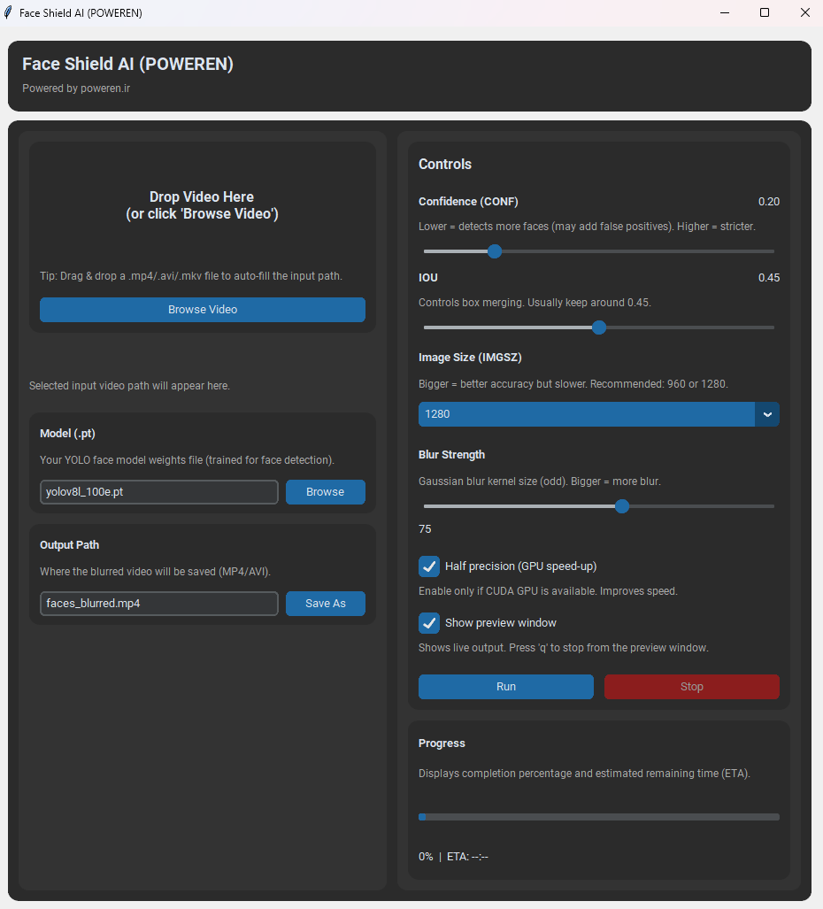
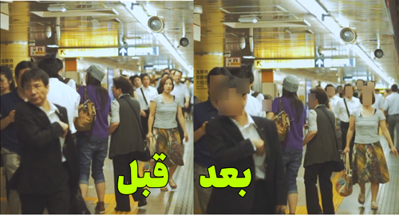
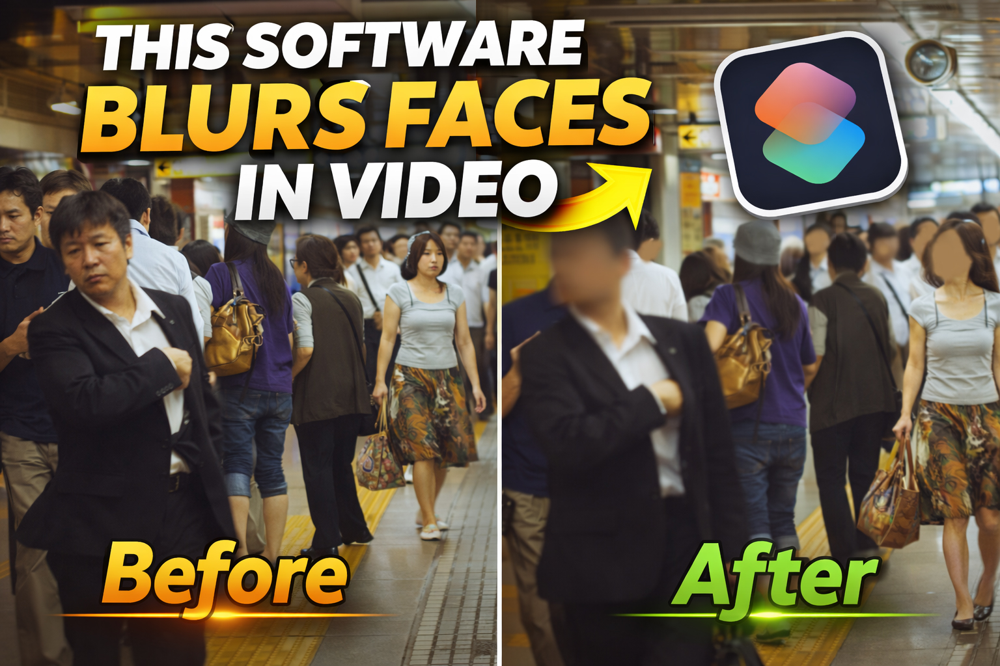

 # 🛡️ Face Shield AI (POWEREN)

> طراحی و توسعه: **poweren.ir**  
> سیستم هوشمند محوسازی چهره با استفاده از YOLOv8

---

## 📸 نمای محیط نرم‌افزار

---

## 🎯 معرفی پروژه

فیس شیلد یک نرم‌افزار دسکتاپ حرفه‌ای برای شناسایی و محوسازی خودکار چهره افراد در ویدیوها است.  
این سیستم با استفاده از مدل آموزش‌دیده‌ی YOLOv8 مخصوص تشخیص چهره، فریم‌های ویدیو را پردازش کرده و چهره‌ها را به‌صورت دقیق شناسایی و محو می‌کند.

این ابزار مناسب است برای:

- حفظ حریم خصوصی در ویدیوهای عمومی  
- پردازش تصاویر شهری و جمعیت  
- انتشار محتوای رسانه‌ای بدون نقض حریم شخصی  
- کاربردهای نظارتی و تحقیقاتی  
- پروژه‌های Smart City  

---

### 🔹 تصویر خروجی (بعد از محوسازی چهره‌ها)

---:
## ⚙️ نحوه عملکرد سیستم

فرآیند پردازش در Face Shield AI به شکل زیر انجام می‌شود:

1. بارگذاری مدل آموزش‌دیده YOLO (.pt)
2. خواندن فریم‌های ویدیو به‌صورت پیوسته
3. تشخیص موقعیت چهره‌ها در هر فریم
4. اعمال Gaussian Blur روی ناحیه چهره
5. ذخیره فریم‌های پردازش‌شده در یک فایل خروجی
6. نمایش پیش‌نمایش زنده (اختیاری)
7. نمایش درصد پیشرفت و زمان باقی‌مانده

---

## 🎛 تنظیمات قابل کنترل در نرم‌افزار

### 🎯 Confidence (آستانه تشخیص)
هرچه مقدار کمتر باشد، چهره‌های بیشتری تشخیص داده می‌شوند (احتمال خطای بیشتر).  
مقدار بالاتر، تشخیص دقیق‌تر ولی سخت‌گیرانه‌تر.

### 🔲 IOU
کنترل نحوه ادغام باکس‌های تشخیص داده‌شده.

### 📏 Image Size (IMGSZ)
افزایش این مقدار دقت را بالا می‌برد ولی سرعت را کاهش می‌دهد.

### 🌫 میزان Blur
شدت محوسازی چهره‌ها (Kernel Size فرد).

### ⚡ Half Precision
در صورت وجود GPU (CUDA)، سرعت پردازش را افزایش می‌دهد.

### 👁 نمایش زنده
امکان مشاهده پردازش در لحظه.

### 📊 نوار پیشرفت و ETA
نمایش درصد انجام کار و زمان تخمینی باقی‌مانده.

---

# 🛡️ Face Shield AI (POWEREN)

> Designed and Developed by **poweren.ir**  
> Intelligent Face Anonymization System using YOLOv8

---

## 📸 Application Interface

---

## 🎯 Project Overview

Face Shield AI is a professional desktop application designed to automatically detect and blur human faces in videos.  

The system uses a trained YOLOv8 face detection model to process video frames and accurately identify and anonymize faces in real time.

This tool is ideal for:

- Privacy protection in public videos  
- Urban and crowd footage processing  
- Media publishing without violating personal privacy  
- Surveillance and research applications  
- Smart City projects  

---

### 🔹 Output Preview (Faces Blurred)

---

## ⚙️ How the System Works

The processing pipeline in Face Shield AI operates as follows:

1. Load a trained YOLO face model (.pt)
2. Read video frames sequentially
3. Detect face locations in each frame
4. Apply Gaussian Blur to detected face regions
5. Save processed frames into a new output video file
6. Display live preview (optional)
7. Show progress percentage and estimated remaining time (ETA)

---

## 🎛 Adjustable Parameters in the Application

### 🎯 Confidence (Detection Threshold)
Lower values detect more faces (with higher chance of false positives).  
Higher values provide stricter and more precise detection.

### 🔲 IOU
Controls how overlapping detection boxes are merged.

### 📏 Image Size (IMGSZ)
Increasing this value improves detection accuracy but reduces processing speed.

### 🌫 Blur Strength
Controls the intensity of Gaussian blur applied to faces (odd kernel size).

### ⚡ Half Precision
If a CUDA-enabled GPU is available, this option increases processing speed.

### 👁 Live Preview
Allows real-time visualization of the processed video.

### 📊 Progress Bar & ETA
Displays completion percentage and estimated remaining time.

---
